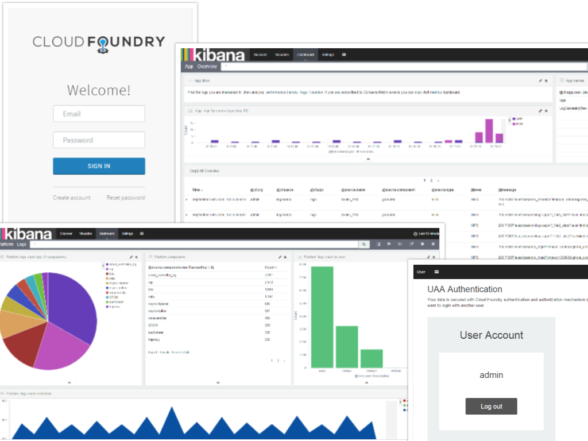

# Logsearch for Cloud Foundry

### Build status

### About

This is a **BOSH-release** add-on for **Logsearch** tool. It extends base **ELK** stack, which provides Logsearch, to work with **CloudFoundry** logs.

So, If you have CloudFoundry deployment and want to make logs management with ELK stack then you choose right product to use. Out-of-the box you’ll get **retrieving and parsing logs** from your CloudFoundry platform, **authorized access** to these logs in Kibana and useful **dashboards and search queries** to start your log analysis with.

You can read [Intro](docs/intro.md) section to understand how Logsearch-for-cloudfoundry relates to ELK, Logsearch and CloudFoundry. Or (if these products and concepts are already familiar) move to [Features](docs/features.md) section to read about main features that Logsearch-for-cloudfoundry adds to Logsearch tool.

### Table of Contents

* [Intro](docs/intro.md)
  * [ELK](docs/intro.md#elk)
  * [Logsearch](docs/intro.md#logsearch)
  * [Logsearch-for-cloudfoundry](docs/intro.md#logsearch-for-cloudfoundry)
* [Features](docs/features.md)
  * [Logs retrieval from CloudFoundry](docs/features.md#logs-retrieval-from-cloudfoundry)
  * [Logstash parsing rules](docs/features.md#logstash-parsing-rules)
  * [Elasticsearch mappings](docs/features.md#elasticsearch-mappings)
  * [Kibana authentication plugin](docs/features.md#kibana-authentication-plugin)
  * [Kibana saved objects](docs/features.md#kibana-saved-objects)
  * [Possibility to deploy Kibana as CloudFoundry application](docs/features.md#possibility-to-deploy-kibana-as-cloudfoundry-application)
* [Jobs](docs/jobs.md) 
* [Deployment](docs/deployment.md)
  * [Deploy Logserach core + Logsearch-for-cloudfoundry from the scratch](docs/deployment.md#deploy-logserach-core-+-logsearch-for-cloudfoundry-from-the-scratch)
  * [Deploy Logsearch-for-cloudfoundry on top of existing Logsearch core deployment](docs/deployment.md#deploy-logsearch-for-cloudfoundry-on-top-of-existing-logsearch-core-deployment)
  * [Deploy Kibana as CloudFoundry application](docs/deployment.md#deploy-kibana-as-cloudfoundry-application) 
* [Logs parsing](docs/logs-parsing.md)
  * [Indices](docs/logs-parsing.md#indices)
  * [Fields](docs/logs-parsing.md#fields)
  * [Parsing rules](docs/logs-parsing.md#parsing-rules)
* [Customization](docs/customization.md)
* [Troubleshooting](docs/troubleshooting.md)
* [Versions](docs/versions.md)
* [Links](docs/links.md)
* [For developers](docs/for-developers.md)
