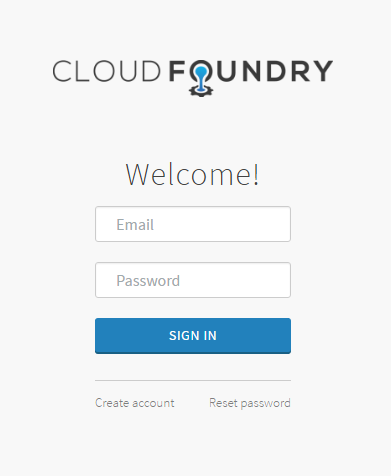

[<- home page](../README.md)
### Features

From this page you can briefly learn main features that Logsearch-for-cloudfoundry adds to Logsearch.

#### Logs retrieval from CloudFoundry

CloudFoundry can be configured to send its _platform logs_ (logs of CloudFoundry components) via _relp_. Logsearch has jobs for accepting logs sent via relp and sending them to _syslog_. Therefore these CloudFoundry logs get in Logsearch with no additional efforts.

For application logs CloudFoundry has [_firehose_](https://github.com/cloudfoundry/firehose-plugin) feature. To get application logs from CloudFoundry using firehose Logsearch-for-cloudfoundry adds a job that runs [_firehose-to-syslog_](https://github.com/cloudfoundry-community/firehose-to-syslog/) utility. This utility written in _golang_ retrieves logs from firehose and sends them to syslog.

So, as the result, CloudFoundry logs (both platform and application) appear in syslog and get processed by Logsearch.

#### Exclude an application from getting its logs in ELK

There is a possibility for CF applications to opt-out of getting their logs in ELK. Technically, the logs "filtering" of such applications is made in the _firehose-to-syslog_ util, so the logs of "ignored" apps do not appear in syslog and, consequently, they don't get into ELK.

To disable logs getting into ELK for an application you need to set the environment variable `F2S_DISABLE_LOGGING=true` for this app:
```sh
$ cf set-env YOUR_APP_NAME F2S_DISABLE_LOGGING true
```
No app restaging is necessary.

Set the `F2S_DISABLE_LOGGING` to `false` when you whant to make this app logs appear in ELK again.

#### Logstash parsing rules

Logsearch has a set of parsing rules for syslog formats. And it's a good start in general case.

Additionally to this, Logsearch-for-cloudfoundry provides a set of parsing rules for CloudFoundry logs using log formats of CloudFoundry components, firehose-to-syslog (for application logs) and general formats such as _JSON_.

For more details on parsing please visit [Logs parsing](logs-parsing.md) page.

#### Elasticsearch mappings

Logsearch-for-cloudfoundry provides Elasticsearch [mappings](../jobs/elasticsearch-config-lfc/templates) for logs indices. The mappings include reasonable rules for fields. They include:

* All string fields are *not_analyzed* by default

  This mapping [is defined](https://github.com/cloudfoundry-community/logsearch-boshrelease/blob/develop/jobs/elasticsearch_config/templates/index-templates/index-mappings.json.erb#L11-L28) in Logsearch release.

* All static fields are mapped according to their datatypes. So, all fields, known during parsing, are mapped implicitly. Dynamic fields (e.g. json fields) are mapped using defined default mappings (see above) and Elasticsearch [_dynamic mapping_](https://www.elastic.co/guide/en/elasticsearch/reference/current/dynamic-mapping.html) mechanism.

* There are two string fields that can be used for full text search - `@raw` and `@message`. These fields are defined as *analyzed* strings. Additionaly, for `@message` field a *not_analyzed* field copy [is defined](../../mappings/jobs/elasticsearch-config-lfc/templates/index-mappings.json.erb#L46) as `@message.raw` - this field can be used for analytics. Field `@raw` [is set](https://github.com/cloudfoundry-community/logsearch-boshrelease/blob/develop/jobs/elasticsearch_config/templates/index-templates/index-mappings.json.erb#L6-L8) to be a default full text search field.

Mappings are uploaded to Elasticsearch in [_indices templates_](https://www.elastic.co/guide/en/elasticsearch/reference/current/indices-templates.html). Note, that Elasticsearch applies them to those indices matching specified index pattern (`template` property in a template) and according to specified order (`order` field).

##### Mappings and Kibana Authentication

Note, that Kibana *authentication plugin* uses fields `@cf.org_id` and `@cf.space_id` for data filtering (read below). And it is important that **these fields should be _not_analyzed_**. Keep this in mind if decide to customize mappings.

#### Kibana authentication plugin

Logsearch-for-cloudfoundry extends Kibana with [authentication plugin](../src/kibana-cf_authentication). The plugin uses [_UAA_](https://github.com/cloudfoundry/uaa) (user authentication and authorization server for CloudFoundry) to authenticate a user and get the account information including organizations and spaces in CloudFoundry platform this user has rights to. 

Based on the account information the user is authorized in Kibana to see *logs of applications running in those organizations and spaces only*. Admin users are authorized to see *all data in Kibana including CloudFoundry platform logs* (admin users are users from system organization - the organisation that owns the CloudFoundry system domain).



From technical point of view, the authorization mechanism applies additional filters to all search requests made from Kibana to Elasticsearch to limit data shown to user. The filtering is done by `@cf.org_id` and `@cf.space_id` fields. To make filtering by these fields possible we specify them as *not_analyzed* in **Elasticsearch mappings** (read [Elasticsearch mappings](#elasticsearch-mappings) section above).

The plugin is delivered in Logsearch-for-cloudfoundry deployment with _cf-kibana_ job (case of Kibana deployed to CloudFoundry) and as a plugin installed to standalone Kibana provided by Logsearch deployment.

##### Redirect after logout
Kibana authentication plugin redirects user to UAA UI for user login and logout accordingly. If you want to get redirected back to the Kibana application after user logout, make sure to enable "redirects after logout" feture in UAA server that you are using. This feature is [disabled](https://github.com/cloudfoundry/uaa/blob/3.9.3/uaa/src/main/webapp/WEB-INF/spring-servlet.xml#L440) by default in UAA. You can enable it in the deployment manifest of your UAA. Example:
```
properties:
...
login:
  logout:
    redirect:
      url: /login
      parameter:
        disable: false
        whitelist:
        - https://my_kibana_domain/login
        - http://my_kibana_domain/login
...
```
(example is built based on the [UAA logout config](https://github.com/cloudfoundry/uaa/blob/3.9.3/uaa/src/main/resources/login.yml#L38-L45) and [UAA-release spec](https://github.com/cloudfoundry/uaa-release/blob/v24/jobs/uaa/spec#L190-L199))

#### Kibana saved objects

Kibana allows to save searches, visualizations, and dashboards and then reuse them when searching data. 

To make some start in logs analysis, Logsearch-for-cloudfoundry creates index patterns and a set of predefined searches, visualizations and dashboards in Kibana. These predefined [Kibana objects](../jobs/upload-kibana-objects/templates/kibana-objects) are uploaded to Elasticsearch (.kibana index) during deploy. Logsearch-for-cloudfoundry allows to skip upload of the defaults and also to specify custom data files to be uploaded to Kibana during deploy (see [Customization](customization.md) page).

Note that any of uploaded Kibana objects can be deleted/modified then using Kibana interface.

#### Possibility to deploy Kibana as CloudFoundry application

Logsearch-for-cloudfoundry provides a possibility to deploy Kibana to a CloudFoundry platform. So that instead of a standalone instance (this option is provided by Logsearch deployment) you get your Kibana running in CloudFoundry.

The pros of this approach (comparing to using of a standalone Kibana instance):

* Easier deployment
* Automatic scalability and load balancing provided by CloudFoundry platform
* Less resources is needed

When deploying you can choose which approach to use. See [Deployment](deployment.md) section for deploy instructions for each option.

---
For details on the features delivery in Logsearch-for-cloudfoundry deployment see [Jobs](jobs.md) page. For customization options visit [Customization](customization.md) page.

</br>[<- prev page](intro.md) | [next page ->](jobs.md)
